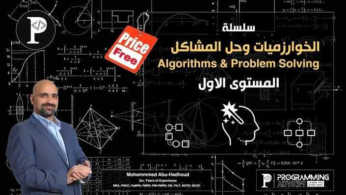

# 🧠 Algorithms & Problem Solving - Level 1

This repository contains my solutions for the **"Algorithms & Problem Solving Level 1"** course by [Programming Advices](https://programmingadvices.com)

  

> [!IMPORTANT]
> Each folder contains solutions to 5 problems. In some cases, a single `.cpp` file may include solutions for all 5 problems.

    
Happy Coding 💻🎉

